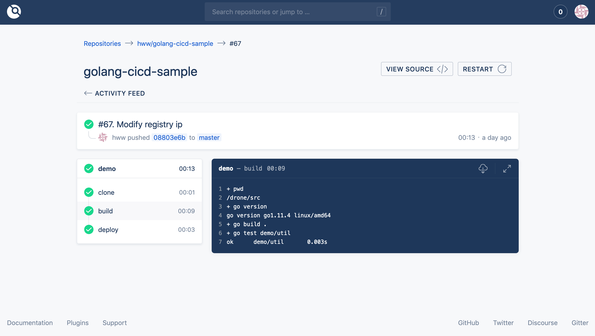

# Setup CI & CD service with gogs & registry and drone
These days I have self hosted DepOps pipeline integrate with gogs, docker private registry and drone on my server, feeling good about it and I wrote done the setup steps and pitfalls developer should be aware of them when building the service.

The complete docker-compose.yml sample -> [drone-gogs-registry-example
](https://github.com/wenweih/drone-gogs-registry-example)

```tree``` displays the directory structure of the current directory
```
ubuntu@VM-0-11-ubuntu:~/drone-gogs-docker$ tree -I 'drone|gogs|data\/registry'
.
├── data
│   └── registry
│       ├── auth
│       │   └── htpasswd
│       ├── certs
│       │   ├── domain.crt
│       │   └── domain.key
└── docker-compose.yaml
```
### Docker Private Registry
Firstly, let's setup docker image private registry. Expose sensitive internal service Docker images to official DockerHub open registry is restrict limitted by many company, so we need to setup our own private Docker images management workflows platform. Docker official Document related with Registry may be a better material deep into it -> [Docker Registry](https://docs.docker.com/registry/)

pull/push image from remote host(e.g. local machine) will fial, Docker daemon reject connection without an valid TSL(Transport Layer Security). To solve the problem with missing TSL, you can purchase commercial from authority website e.g. godaddy, or using letsencrypt for free, moreover if you guy don't like any others third party dependences, self signed certificate. login to server and genenrate cert key paire by openssl on specify folder(```drone-gogs-docker/data/registry/certs```):
```
openssl req -newkey rsa:4096 -nodes -sha256 -keyout domain.key \
            -subj "/C=US/ST=CA/O=Acme, Inc./CN=example.com" \
            -reqexts SAN -extensions SAN -config <(cat /etc/ssl/openssl.cnf <(printf "[SAN]\nsubjectAltName=DNS:example.com,DNS:www.example.com")) -x509 -days 365 -out domain.crt
```
- You would need to replace values in -subj and under [SAN] extension. Benefit of this command is you need not modify the /etc/ssl/openssl.conf file.
- If you do not have a domain name for the registry and using IP address instead consider replacing [SAN] section in above command to have IP: <ip-address> instead of DNS.

Finally you have two files:
- domain.cert – this file can be handled to the client using the private registry
- domain.key – this is the private key which is necessary to run the private registry with TLS

Meanwhile, generate registry auth configure on ```drone-gogs-docker/data/registry/auth``` directory:
```
docker run --entrypoint htpasswd registry:latest -Bbn {registyusr} {registypass} > auth/htpasswd
```

registry and webui docker image code syntax for docker-compose.yml
```
# https://ijayer.github.io/post/tech/devops/docker/20181026-registry-and-webui/
registry-web: # Registry Web UI
  restart: always
  image: parabuzzle/craneoperator:latest
  container_name: registry-web
  ports:
    - 5001:80
  depends_on:
    - registry
  environment:
    - REGISTRY_HOST=registry
    - REGISTRY_PORT=5000
    - REGISTRY_USERNAME={registyusr}
    - REGISTRY_PASSWORD={registypass}
    - REGISTRY_PROTOCOL=https
    # https://www.engineyard.com/blog/ruby-ssl-error-certificate-verify-failed
    - SSL_VERIFY=false
    - ALLOW_REGISTRY_LOGI=true
    - REGISTRY_ALLOW_DELETE=true
registry:     # Priavate Registry Server
  restart: always
  image: registry:latest
  container_name: registry
  ports:
    - 5000:5000
  volumes:
    - ./data/registry/data:/var/lib/registry
    - ./data/registry/certs:/certs
    - ./data/registry/auth:/auth

  environment:
    - REGISTRY_HTTP_SECRET=xxx
    - REGISTRY_HTTP_TLS_CERTIFICATE=/certs/domain.crt
    - REGISTRY_HTTP_TLS_KEY=/certs/domain.key
    - REGISTRY_AUTH=htpasswd
    - REGISTRY_AUTH_HTPASSWD_PATH=/auth/htpasswd
    - REGISTRY_AUTH_HTPASSWD_REALM=Registry Realm
    - REGISTRY_STORAGE_DELETE_ENABLED=true
```
### Gogs
Gogs image code syntax on docker-compose.yml
```
gogs:
  container_name: 'gogs'
  image: gogs/gogs:latest
  ports:
    - "10022:22"
    - "3000:3000"
  volumes:
    - ./data/gogs:/data
  depends_on:
    - mysql
mysql:
  container_name: 'mysql'
  image: mysql:5.7.16
  volumes:
    - ./gogs/mysql:/var/lib/mysql
    - /var/run/docker.sock:/var/run/docker.sock
  ports:
    - 3308:3306
  command: --character-set-server=utf8mb4 --collation-server=utf8mb4_unicode_ci
  environment:
    MYSQL_ROOT_PASSWORD: pass
    MYSQL_DATABASE: gogs
    MYSQL_USER: gogs
    MYSQL_PASSWORD: pass
    TZ: Asia/Shanghai
```
### Drone
Drone consists of two main parts: Server, and Agent(s). Drone Server is a master part, a central piece which serves user interface and exposes API. Drone Agent is a worker part, it pulls jobs from Drone Server, executes them and pushes the results back. You can scale the system by adding more agents, so it can handle more jobs.

Drone server and agent images code syntax on docker-compose.yml
```
# https://developpaper.com/build-your-own-ci-cd-system-with-drone-and-gogs/
drone-server:
  container_name: 'drone-server'
  image: drone/drone:latest
  ports:
    - "8080:80"
    - 8843:443
    - 9000
  volumes:
    - ./drone:/var/lib/drone/
    - /var/run/docker.sock:/var/run/docker.sock
  environment:
    - DRONE_OPEN=true
    - DRONE_SERVER_HOST=drone-server
    - DRONE_DEBUG=true
    - DRONE_GIT_ALWAYS_AUTH=false
    - DRONE_GOGS=true
    - DRONE_GOGS_SKIP_VERIFY=false
    - DRONE_GOGS_SERVER=http://gogs:3000
    - DRONE_PROVIDER=gogs
    - DRONE_DATABASE_DATASOURCE=/var/lib/drone/drone.sqlite
    - DRONE_DATABASE_DRIVER=sqlite3
    - DRONE_SERVER_PROTO=http
    - DRONE_RPC_SECRET=xxx
    - DRONE_SECRET=xxx
drone-agent:
  container_name: 'drone-agent'
  image: drone/agent:latest
  depends_on:
    - drone-server
  environment:
    - DRONE_RPC_SERVER=http://drone-server
    - DRONE_RPC_SECRET=xxx
    - DRONE_DEBUG=true
    - DOCKER_HOST=tcp://docker-bind:2375
    - DRONE_SERVER=drone-server:9000
    - DRONE_SECRET=xxx
    - DRONE_MAX_PROCS=5
docker-bind:
  image: docker:dind
  container_name: 'docker-bind'
  privileged: true
  command: --storage-driver=overlay
```
### Usage
The completely [docker-compose.yml](https://github.com/wenweih/drone-gogs-registry-example/blob/master/docker-compose.yaml). feel free to modify to match your server real info on it. e.g. authentication, ip, port or domain. execute ```docker-compose up -d``` command in the directory, once all services(gogs, registry, dron service and agent) running corectly and then visit ```http://{ip}:3000/``` to init Gogs configure. After Gogs user is setup, we can login dron ```http://{ip}:8080/login/form``` using gogs account.



latest but not least, ```certificate signed by unknown authority``` issue is common when using registry self signed certificate. there are two way to address
- copy the domain.cert and rename to ca.crt on machine(which do login/pull/push registry operation) directory. e.g. ```/etc/docker/certs.d/ip:port/ca.crt``` on my other machine.
- mkdir certificate folder(/etc/docker/certs.d/ip:port) and run command on the directory ```openssl s_client -showcerts -connect {ip}:{port} < /dev/null | sed -ne '/-BEGIN CERTIFICATE-/,/-END CERTIFICATE-/p' > ca.crt```
### Recommand reading
- [Continuous Delivery with Drone CI](https://medium.com/@sergey.kolodyazhnyy/continuous-delivery-with-drone-ci-3a3fea5aa83)
- [使用drone和gogs搭建自己的CI/CD系统](https://kanda.me/2019/03/06/building-ci-cd-system-by-drone/)
